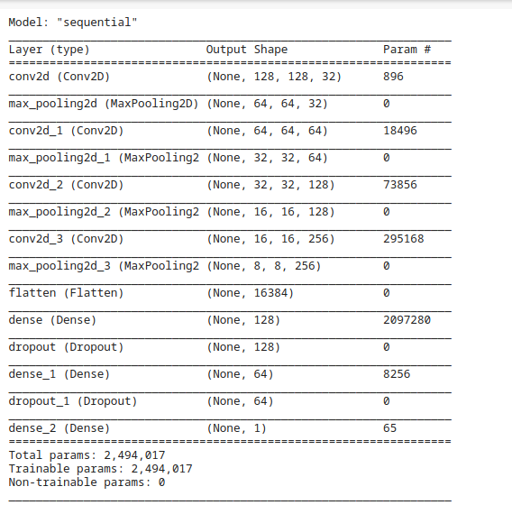

# Malaria Infection Detection

### Implemented convolutional neural network (CNN) using tensorflow 

## Dataset
Dataset is from the official NIH Website.
 
available at kaggle - https://www.kaggle.com/iarunava/cell-images-for-detecting-malaria
 
Dataset contains more than 27K images of body cell (infected and uninfected both)
 
 
uninfected
 

 
uninfected
 
	
 

## Network Architecture Used

 

## Learning Curve
Blue - Training accuracy | Orange - Validation accuracy
 

 

## Model Result
#### Training Accuracy: 0.9647
#### Validation Accuracy: 0.9409
